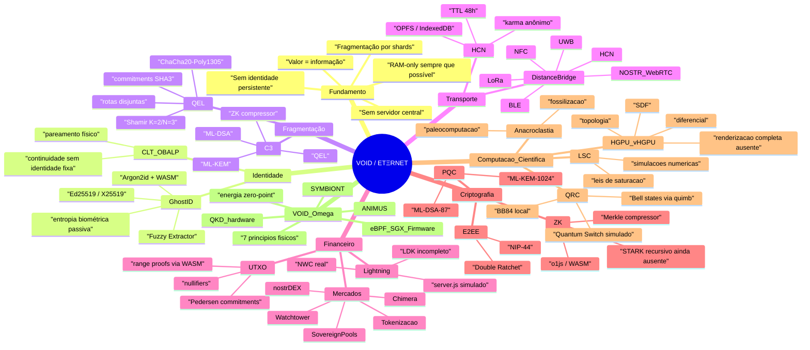

# VOID - Mapa Mental Geral

Esta nota consolida a pasta `DOC/` em uma visão única: o que o VOID/ETΞRNET promete, quais camadas existem no código e quais partes ainda são teoria, simulação ou hardware futuro.

## Mapa mental

## Leituras principais da pasta DOC

- `VOID.pdf`: livro-mãe. Une Hydra/VØID, HGPU, QRC, plataforma ETΞRNET, Phantom Shopper, colapsos com memória, LSC, anacroclastia e fusões financeiras.
- `ETΞRNET.pdf` e `Hydronia v8.txt`: narrativa da fusão Hydra + VØID: GhostID, QEL, DistanceBridge, UTXO+ZK, PQC e pagamentos invisíveis.
- `SOBERANIA_FINANÇEIRA.pdf`: expande Phantom Shopper, GhostVPN, EcoNet, Mirage Compute, Aegis Vault, Janus, Chimera e SIPs.
- `VØID·ΩMEGA.txt`: camada teórica mais ambiciosa: VØID como lei física, SYMBIONT e ANIMUS.
- `HGPU___vHGPU.pdf`: unidade geométrica homotópica: SDF, PDE/Flow Core, Differential Core, Topology Tracker, Ray Continuation e Homotopy Cache.
- `CQR.pdf`: base de Computação Quântico-Relativística; no código aparece como backend local de redes tensoriais, Bell states, BB84 e Quantum Switch simulado.
- `Teoria_LSC.pdf`, `Teoria_da_Mecânica_dos_Colapsos_com_Memória.pdf` e `PaleoComputação.pdf`: pesquisa científica e especulativa transformada parcialmente em motores TS/Python.

## Camadas de maturidade

- **Núcleo implementado**: GhostID, QEL, PQC, UTXO, HCNStore, NOSTR/WebRTC, drivers locais, LoRa, NWC, Watchtower, quantum backend local, C3 e parte da compressão ZK.
- **Parcial / dependente de ambiente**: DistanceBridge completo, BLE advertising, NFC/UWB/LoRa real, Quantum Bridge real apenas com servidor Python, NOSTR real apenas com relays acessíveis, LDK Bridge, contrato Solidity sem pipeline de deploy.
- **Simulação clássica**: QRC Quantum Switch, vHGPU/QRC financeiro, parte dos painéis de rede e ciência, servidor Lightning/Bitcoin em `server/server.js`, price/live feeds de UI.
- **Teoria / futuro**: VØID·ΩMEGA físico, SYMBIONT, ANIMUS, QKD real, energia zero-point, eBPF/SGX/firmware, zk-STARK recursivo real, HGPU como arquitetura de hardware.

## Notas relacionadas

- [[VOID - Realidade do Código]]
- [[VOID - Simulações e Faltantes]]
- [[VOID - Plano de Conclusão]]
- [[Estado do Código]]
- [[Arquitetura Produção v1.0]]
